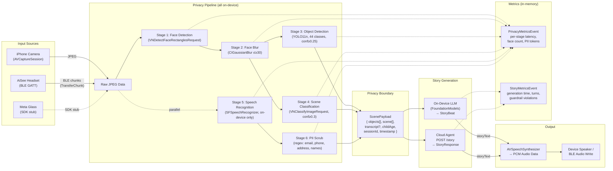
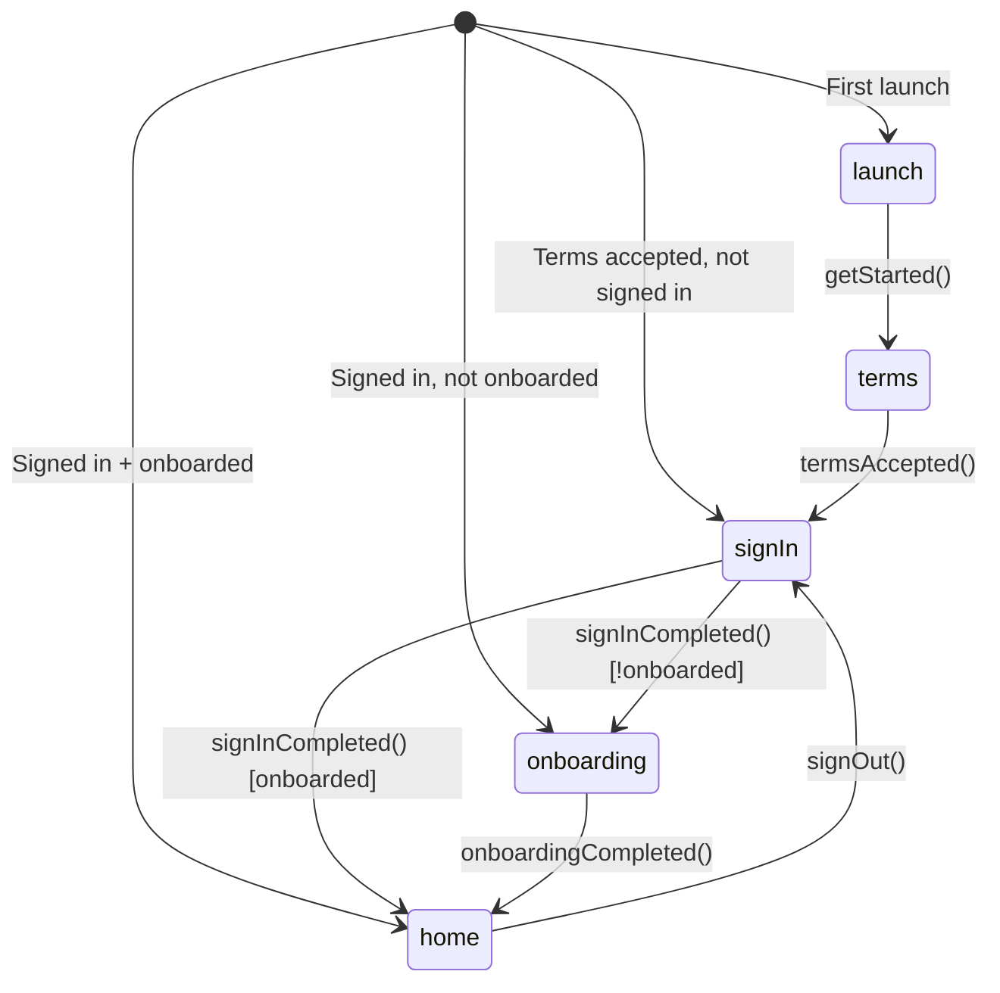
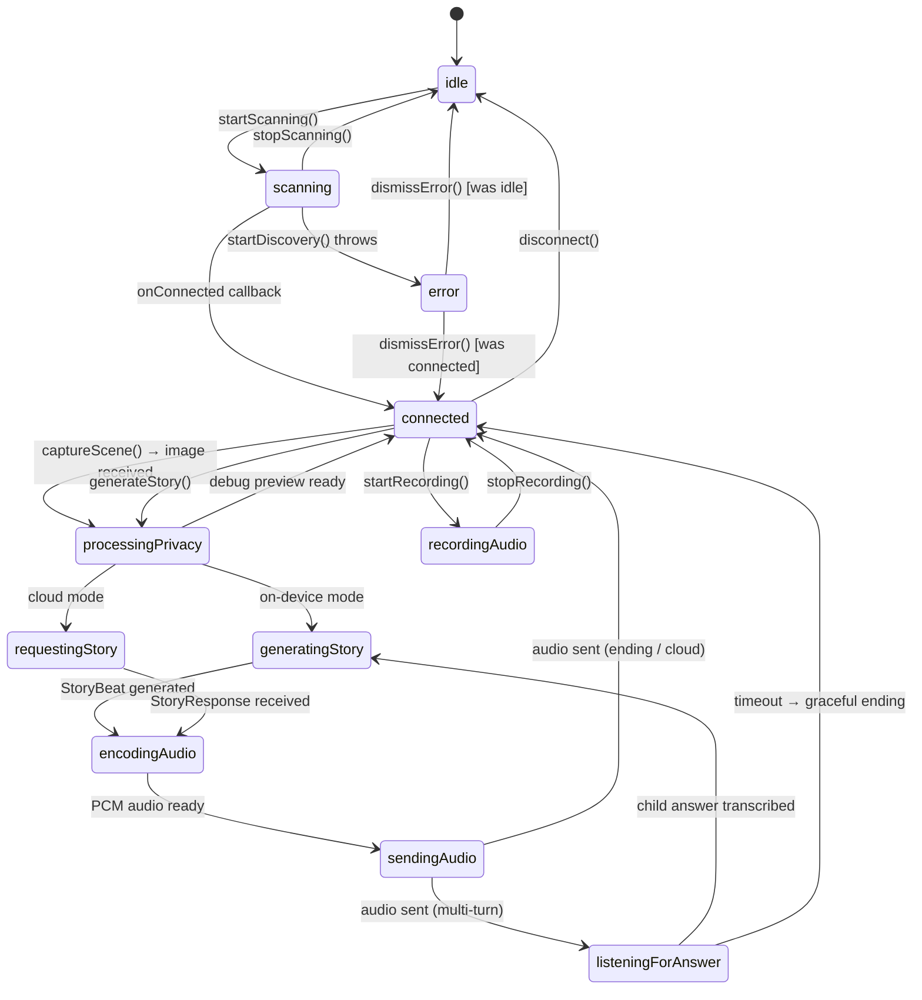
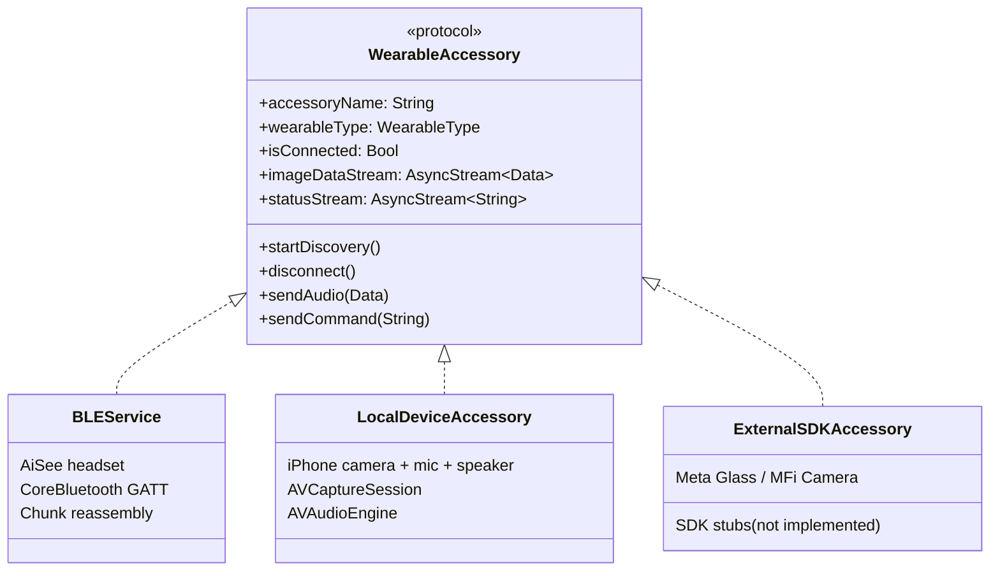

# SeeSaw Companion iOS — Comprehensive Codebase Blueprint

> **Auto-generated from source code analysis — April 2026**

---

## 1. Project Overview

**SeeSaw** is a privacy-first iOS companion app for AI-powered interactive storytelling for children. A parent sets up the app, connects a wearable input device (or the iPhone itself), and the app:

1. **Captures** a scene image from the connected device
2. **Processes** it through an entirely on-device privacy pipeline (face blur, object detection, scene classification, speech-to-text, PII scrubbing)
3. **Generates** an interactive story using one of three modes: Apple Foundation Models (on-device), Gemma 3 1B via MediaPipe (on-device), or Cloud Run + Gemini 2.0 Flash
4. **Reads aloud** the story via text-to-speech back through the connected device
5. **Listens** for the child's verbal answer and continues the story in a multi-turn loop

**Key constraints:** Raw images, audio, and biometrics **never** leave the device. Only anonymised scene labels (`ScenePayload`) cross the privacy boundary.

---

## 2. Technical Architecture Diagram

```mermaid
graph TB
    subgraph "Presentation Layer"
        AppRootView["AppRootView<br/>(SeeSawApp.swift)"]
        LaunchScreen["LaunchScreenView"]
        TermsScreen["TermsView"]
        SignInScreen["SignInView"]
        OnboardingScreen["OnboardingView<br/>(3-step wizard)"]
        HomeScreen["HomeView<br/>(TabView)"]
        CameraTab["CameraTabView"]
        TimelineTab["TimelineTabView"]
        SettingsTab["SettingsTabView"]
        ScenePreview["ScenePreviewView<br/>(YOLO overlay)"]
        CameraPreview["CameraPreviewView<br/>(AVCaptureVideoPreviewLayer)"]
    end

    subgraph "Coordination & DI"
        Coordinator["AppCoordinator<br/>(@Observable)"]
        Container["AppDependencyContainer"]
    end

    subgraph "ViewModel Layer"
        AuthVM["AuthViewModel"]
        OnboardingVM["OnboardingViewModel"]
        CompanionVM["CompanionViewModel<br/>(central orchestrator)"]
    end

    subgraph "Service Layer"
        direction LR
        subgraph "Accessory"
            AccMgr["AccessoryManager"]
            BLE["BLEService<br/>(CoreBluetooth)"]
            Local["LocalDeviceAccessory<br/>(AVFoundation)"]
            ExtSDK["ExternalSDKAccessory<br/>(Meta Glass / MFi stub)"]
        end
        subgraph "AI / Pipeline"
            Pipeline["PrivacyPipelineService<br/>(actor)"]
            StoryService["OnDeviceStoryService<br/>(FoundationModels)"]
            PIIScrub["PIIScrubber"]
            PMetrics["PrivacyMetricsStore"]
            SMetrics["StoryMetricsStore"]
        end
        subgraph "Audio"
            AudioSvc["AudioService<br/>(AVSpeechSynthesizer)"]
            AudioCap["AudioCaptureService<br/>(AVAudioEngine)"]
            SpeechRec["SpeechRecognitionService<br/>(SFSpeechRecognizer)"]
        end
        subgraph "Cloud"
            CloudAgent["CloudAgentService<br/>(URLSession)"]
        end
        subgraph "Auth"
            AuthSvc["AuthenticationService<br/>(Firebase + Apple + Google)"]
        end
    end

    subgraph "On-Device ML"
        YOLO["seesaw-yolo11n.mlpackage<br/>(44-class object detection)"]
        VisionFace["VNDetectFaceRectanglesRequest"]
        VisionScene["VNClassifyImageRequest"]
        FoundationLLM["Apple Foundation Models<br/>(LanguageModelSession)"]
    end

    AppRootView --> Coordinator
    Coordinator --> Container
    Coordinator -->|route| LaunchScreen
    Coordinator -->|route| TermsScreen
    Coordinator -->|route| SignInScreen
    Coordinator -->|route| OnboardingScreen
    Coordinator -->|route| HomeScreen
    HomeScreen --> CameraTab
    HomeScreen --> TimelineTab
    HomeScreen --> SettingsTab
    CameraTab --> ScenePreview
    CameraTab --> CameraPreview

    SignInScreen --> AuthVM --> AuthSvc
    OnboardingScreen --> OnboardingVM --> AccMgr
    HomeScreen --> CompanionVM
    CameraTab --> CompanionVM

    CompanionVM --> AccMgr
    CompanionVM --> Pipeline
    CompanionVM --> CloudAgent
    CompanionVM --> AudioSvc
    CompanionVM --> AudioCap
    CompanionVM --> SpeechRec
    CompanionVM --> StoryService
    CompanionVM --> PMetrics
    CompanionVM --> SMetrics

    AccMgr --> BLE
    AccMgr --> Local
    AccMgr --> ExtSDK
    BLE --> |"chunks"| ChunkBuf["ChunkBuffer"]

    Pipeline --> VisionFace
    Pipeline --> YOLO
    Pipeline --> VisionScene
    Pipeline --> SpeechRec
    Pipeline --> PIIScrub

    StoryService --> FoundationLLM
    StoryService --> StoryTools["StoryTools<br/>(AdjustDifficulty,<br/>BookmarkMoment,<br/>SwitchScene)"]
```



---

## 3. User Flow Diagram

```mermaid
flowchart TD
    Start([App Launch]) --> CheckState{Persisted<br/>State?}
    
    CheckState -->|First launch| S1[Screen 1: LaunchScreenView<br/>"Get Started"]
    CheckState -->|Terms accepted,<br/>not signed in| S3[Screen 3: SignInView]
    CheckState -->|Signed in,<br/>not onboarded| S4[Screen 4: OnboardingView]
    CheckState -->|Signed in +<br/>onboarded| S5[Screen 5: HomeView]

    S1 -->|"getStarted()"| S2[Screen 2: TermsView<br/>Accept Terms & Conditions]
    S2 -->|"termsAccepted()"| S3
    S3 -->|Apple / Google<br/>Sign-In| S3Auth{Sign-In<br/>Success?}
    S3Auth -->|Yes + not onboarded| S4
    S3Auth -->|Yes + already onboarded| S5
    S3Auth -->|No| S3

    S4 --> Step0[Step 0: Pick Accessory<br/>iPhone / AiSee / Meta Glass]
    Step0 --> Step1[Step 1: Child Preferences<br/>Name, Age, Favourite Topics]
    Step1 --> Step2[Step 2: Welcome / Success]
    Step2 -->|"completeOnboarding()"| S5

    S5 --> TabCamera[📷 Camera Tab]
    S5 --> TabTimeline[🕐 Timeline Tab]
    S5 --> TabSettings[⚙️ Settings Tab]

    TabCamera --> Connect[Connect to Accessory]
    Connect --> Preview[Live Camera Preview]
    Preview --> Capture["'Capture Scene' button"]
    Capture --> DebugPreview[ScenePreviewView<br/>Face-blurred image<br/>+ YOLO bounding boxes]
    DebugPreview --> Generate["'Generate Story' button"]
    Generate --> Pipeline[Privacy Pipeline<br/>processes image]
    Pipeline --> StoryGen{Story Mode?}
    
    StoryGen -->|onDevice| OnDevice[Apple Foundation Models<br/>LanguageModelSession]
    StoryGen -->|gemma4OnDevice| Gemma4[MediaPipe LlmInference<br/>Gemma 3 1B Q4_K_M GGUF]
    StoryGen -->|cloud| Cloud[POST ScenePayload<br/>to Cloud Run Gemini 2.0 Flash]
    StoryGen -->|hybrid| OnDevice

    OnDevice --> TTS[Text-to-Speech<br/>via AVSpeechSynthesizer]
    Gemma4 --> TTS
    Cloud --> TTS
    TTS --> SendAudio[Send audio to<br/>connected accessory]
    SendAudio --> Listen[Listen for child's<br/>verbal answer]
    Listen --> Transcribe[On-device STT<br/>+ PII scrub]
    Transcribe --> Continue{More turns<br/>remaining?}
    Continue -->|Yes| OnDevice
    Continue -->|No / Timeout| EndStory[Graceful story ending<br/>→ Connected state]

    TabSettings --> SignOut[Sign Out<br/>→ SignInView]
```

---

## 4. Data Flow Diagram



---

## 5. Class Diagram

```mermaid
classDiagram
    direction TB

    %% ===== App Layer =====
    class SeeSawApp {
        +body: Scene
        +init()
    }
    class AppRootView {
        -coordinator: AppCoordinator
        +body: View
    }
    class AppCoordinator {
        <<@Observable, @MainActor>>
        +currentRoute: Route
        +container: AppDependencyContainer
        +getStarted()
        +termsAccepted()
        +signInCompleted()
        +onboardingCompleted()
        +signOut()
    }
    class AppDependencyContainer {
        <<@MainActor>>
        +bleService: BLEService
        +localDeviceAccessory: LocalDeviceAccessory
        +metaGlassAccessory: ExternalSDKAccessory
        +mfiCameraAccessory: ExternalSDKAccessory
        +accessoryManager: AccessoryManager
        +privacyPipelineService: PrivacyPipelineService
        +cloudAgentService: CloudAgentService
        +audioService: AudioService
        +audioCaptureService: AudioCaptureService
        +speechRecognitionService: SpeechRecognitionService
        +authService: AuthenticationService
        +privacyMetricsStore: PrivacyMetricsStore
        +onDeviceStoryService: OnDeviceStoryService
        +storyMetricsStore: StoryMetricsStore
        +makeCompanionViewModel(): CompanionViewModel
        +makeAuthViewModel(): AuthViewModel
        +makeOnboardingViewModel(): OnboardingViewModel
    }
    class AppConfig {
        <<Sendable, singleton>>
        +shared: AppConfig
        +enableLogging: Bool
        +useTestImageForPreview: Bool
        +log(message, level)
    }

    %% ===== ViewModel Layer =====
    class CompanionViewModel {
        <<@Observable, @MainActor>>
        +sessionState: SessionState
        +lastError: String?
        +timeline: [TimelineEntry]
        +storyMode: StoryGenerationMode
        +storyTurnCount: Int
        +streamingStoryText: String
        +isShowingScenePreview: Bool
        +sceneDetections: [DetectionResult]
        +currentTranscript: String?
        +startScanning()
        +stopScanning()
        +disconnect()
        +captureScene()
        +generateStory()
        +startRecording()
        +stopRecording()
        -runDetectionPreview(jpegData)
        -runFullPipeline(jpegData)
        -runOnDevicePipeline(jpegData)
        -runCloudPipeline(jpegData)
        -continueStoryLoop()
        -listenForAnswer(timeout): String?
        -endStoryGracefully()
    }
    class AuthViewModel {
        <<@Observable, @MainActor>>
        +isLoading: Bool
        +errorMessage: String?
        +handleAppleSignIn(result)
        +handleGoogleSignIn()
        +clearError()
    }
    class OnboardingViewModel {
        <<@Observable, @MainActor>>
        +currentStep: Step
        +connectionStatus: ConnectionStatus
        +childName: String
        +childAge: Int
        +selectedPreferences: Set~String~
        +next()
        +back()
        +selectAccessoryType(type)
        +connectAccessory()
        +completeOnboarding()
    }

    %% ===== Protocol =====
    class WearableAccessory {
        <<protocol, @MainActor>>
        +accessoryName: String
        +wearableType: WearableType
        +isConnected: Bool
        +onConnected: Callback?
        +onDisconnected: Callback?
        +imageDataStream: AsyncStream~Data~
        +statusStream: AsyncStream~String~
        +audioDataStream: AsyncStream~Data~
        +startDiscovery() async throws
        +stopDiscovery() async
        +disconnect() async
        +sendAudio(Data) async throws
        +sendCommand(String) async throws
        +startAudioCapture() async throws
        +stopAudioCapture() async throws
    }
    class StoryGenerating {
        <<protocol, Sendable>>
        +startStory(context, profile): StoryBeat
        +continueTurn(childAnswer): StoryBeat
        +endSession()
        +isSessionActive: Bool
        +currentTurnCount: Int
    }

    %% ===== Service Layer =====
    class AccessoryManager {
        <<@Observable, @MainActor>>
        +selectedType: WearableType
        +activeAccessory: WearableAccessory
        +previewSession: AVCaptureSession?
        +disconnectAll()
    }
    class BLEService {
        <<@MainActor>>
        -centralManager: CBCentralManager
        -connectedPeripheral: CBPeripheral
        -chunkBuffer: ChunkBuffer
    }
    class LocalDeviceAccessory {
        <<@MainActor>>
        -captureSession: AVCaptureSession
        -photoOutput: AVCapturePhotoOutput
        -audioEngine: AVAudioEngine
        +previewSession: AVCaptureSession?
    }
    class ExternalSDKAccessory {
        <<@MainActor>>
        +wearableType: WearableType
    }
    class ChunkBuffer {
        <<@unchecked Sendable>>
        -buffer: Dict~Int,Data~
        +add(chunk): Data?
        +reset()
    }
    class PrivacyPipelineService {
        <<actor>>
        -objectDetectionModel: VNCoreMLModel?
        -speechService: SpeechRecognitionService
        +process(jpegData, childAge, audioData?): PipelineResult
        +runDebugDetection(jpegData): (Data, [DetectionResult], Metrics)
        -detectAndBlurFaces(image): (CIImage, Int)
        -detectObjects(image): [String]
        -classifyScene(image): [String]
        -recognizeSpeech(audioData): String?
    }
    class OnDeviceStoryService {
        <<actor>>
        -session: LanguageModelSession?
        -turnCount: Int
        -maxTurns: Int = 6
        +startStory(context, profile): StoryBeat
        +streamStartStory(context, profile, onPartial): StoryBeat
        +continueTurn(childAnswer): StoryBeat
        +streamContinueTurn(childAnswer, onPartial): StoryBeat
        +endSession()
        +checkAvailability(): ModelAvailabilityStatus
        -generateWithErrorRecovery(prompt): StoryBeat
        -streamWithErrorRecovery(prompt, onPartial): StoryBeat
        -restartWithSummary(lastPrompt): StoryBeat
        -retrySoftened(attempt): StoryBeat
    }
    class PIIScrubber {
        <<enum, static>>
        +scrub(text): (scrubbed, tokensRedacted)
    }
    class AudioService {
        <<actor>>
        +generateAndEncodeAudio(text): Data
        -synthesizeWithAVSpeech(text): Data
    }
    class AudioCaptureService {
        <<actor>>
        +isCapturing: Bool
        +audioBufferStream: AsyncStream~AVAudioPCMBuffer~
        +startCapture() async throws
        +stopCapture(): Data
        +requestMicPermission()
    }
    class SpeechRecognitionService {
        <<actor>>
        +requestAuthorization(): Bool
        +startLiveTranscription(stream): AsyncStream~TranscriptionResult~
        +stopTranscription(): String?
        +transcribeAudioData(data): String?
    }
    class CloudAgentService {
        <<actor>>
        -baseURL: URL
        +requestStory(payload): StoryResponse
        +updateBaseURL(url)
    }
    class AuthenticationService {
        <<actor>>
        +currentSession: UserSession?
        +isSignedIn: Bool
        +signInWithApple(credential)
        +signInWithGoogle() async throws
        +signOut()
    }
    class PrivacyMetricsStore {
        <<actor>>
        +record(event)
        +allEvents(): [PrivacyMetricsEvent]
        +averageLatency(): Double
        +privacySanitisationRate(): Double
        +exportCSV(): String
    }
    class StoryMetricsStore {
        <<actor>>
        +record(event)
        +averageGenerationMs(): Double
        +averageTimeToFirstTokenMs(): Double
        +exportCSV(): String
    }

    %% ===== Model Layer =====
    class SessionState {
        <<enum>>
        idle
        scanning
        connected
        receivingImage
        processingPrivacy
        requestingStory
        encodingAudio
        sendingAudio
        recordingAudio
        transcribingAudio
        generatingStory
        listeningForAnswer
        error(String)
    }
    class ScenePayload {
        <<Codable, Sendable>>
        +objects: [String]
        +scene: [String]
        +transcript: String?
        +childAge: Int
        +sessionId: String
        +timestamp: String
    }
    class SceneContext {
        <<Sendable>>
        +labels: [String]
        +sceneCategories: [String]
        +transcript: String?
        +childAge: Int
    }
    class StoryBeat {
        <<@Generable, Sendable>>
        +storyText: String
        +question: String
        +isEnding: Bool
        +theme: String
        +suggestedContinuation: String
        +safeFallback$: StoryBeat
        +endingFallback$: StoryBeat
    }
    class ChildProfile {
        <<Sendable>>
        +name: String
        +age: Int
        +preferences: [String]
        +presetTopics$: [String]
    }
    class WearableType {
        <<enum>>
        iPhoneCamera
        aiSeeBLE
        metaGlass
        mfiCamera
    }
    class TransferChunk {
        <<Sendable>>
        +seqNum: UInt16
        +total: UInt16
        +payload: Data
        +init?(from: Data)
        +toPacket(): Data
        +makeChunks$(from: Data): [TransferChunk]
    }
    class PipelineResult {
        <<Sendable>>
        +payload: ScenePayload
        +metrics: PrivacyMetricsEvent
    }
    class DetectionResult {
        <<Sendable>>
        +label: String
        +confidence: Float
        +boundingBox: CGRect
    }
    class UserSession {
        <<Sendable>>
        +userID: String
        +fullName: String?
        +email: String?
        +provider: AuthProvider
    }
    class TimelineEntry {
        <<Identifiable, Sendable>>
        +id: UUID
        +timestamp: Date
        +sceneObjects: [String]
        +storySnippet: String?
    }
    class StoryBookmark {
        <<Sendable>>
        +description: String
        +timestamp: Date
    }

    %% ===== Tool Types (Foundation Models) =====
    class AdjustDifficultyTool {
        <<Tool>>
        +call(level: Int): String
    }
    class BookmarkMomentTool {
        <<Tool>>
        +call(description: String): String
    }
    class SwitchSceneTool {
        <<Tool>>
        +call(newSetting: String): String
    }

    %% ===== Relationships =====
    SeeSawApp --> AppRootView
    AppRootView --> AppCoordinator
    AppCoordinator --> AppDependencyContainer
    AppDependencyContainer --> AccessoryManager
    AppDependencyContainer --> PrivacyPipelineService
    AppDependencyContainer --> CloudAgentService
    AppDependencyContainer --> AudioService
    AppDependencyContainer --> AudioCaptureService
    AppDependencyContainer --> SpeechRecognitionService
    AppDependencyContainer --> AuthenticationService
    AppDependencyContainer --> OnDeviceStoryService
    AppDependencyContainer --> PrivacyMetricsStore
    AppDependencyContainer --> StoryMetricsStore

    CompanionViewModel --> AccessoryManager
    CompanionViewModel --> PrivacyPipelineService
    CompanionViewModel --> CloudAgentService
    CompanionViewModel --> AudioService
    CompanionViewModel --> AudioCaptureService
    CompanionViewModel --> SpeechRecognitionService
    CompanionViewModel --> OnDeviceStoryService
    CompanionViewModel --> PrivacyMetricsStore
    CompanionViewModel --> StoryMetricsStore

    AuthViewModel --> AuthenticationService
    OnboardingViewModel --> AccessoryManager

    AccessoryManager --> BLEService
    AccessoryManager --> LocalDeviceAccessory
    AccessoryManager --> ExternalSDKAccessory

    BLEService ..|> WearableAccessory
    LocalDeviceAccessory ..|> WearableAccessory
    ExternalSDKAccessory ..|> WearableAccessory
    OnDeviceStoryService ..|> StoryGenerating

    BLEService --> ChunkBuffer
    PrivacyPipelineService --> SpeechRecognitionService
    PrivacyPipelineService --> PIIScrubber
    OnDeviceStoryService --> AdjustDifficultyTool
    OnDeviceStoryService --> BookmarkMomentTool
    OnDeviceStoryService --> SwitchSceneTool

    SceneContext --> ScenePayload : "bridges"
    PipelineResult --> ScenePayload
    PipelineResult --> PrivacyMetricsEvent
    CompanionViewModel --> TimelineEntry
```



---

## 6. File Structure & Layer Mapping

| Layer | Directory | Files | Responsibility |
|-------|-----------|-------|----------------|
| **App Entry** | `SeeSaw/` | `SeeSawApp.swift`, `ContentView.swift` | `@main`, Firebase init, root view |
| **Coordination** | `SeeSaw/App/` | `AppCoordinator.swift`, `AppDependencyContainer.swift`, `AppConfig.swift`, `AppConfig+Logging.swift` | Navigation state machine, DI, config, logging |
| **Models** | `SeeSaw/Model/` | 19 files | Value types, enums, protocols — zero business logic |
| **Services / Accessory** | `SeeSaw/Services/Accessory/` | `AccessoryManager.swift`, `LocalDeviceAccessory.swift`, `ExternalSDKAccessory.swift` | Hardware abstraction, multi-device support |
| **Services / BLE** | `SeeSaw/Services/BLE/` | `BLEService.swift`, `ChunkBuffer.swift` | CoreBluetooth GATT central, chunk reassembly |
| **Services / AI** | `SeeSaw/Services/AI/` | 9 files | Privacy pipeline, LLM story generation (Apple FM + Gemma3), ModelDownloadManager, PII scrubbing, metrics |
| **Services / Audio** | `SeeSaw/Services/Audio/` | `AudioService.swift`, `AudioCaptureService.swift`, `SpeechRecognitionService.swift` | TTS, mic capture, on-device STT |
| **Services / Auth** | `SeeSaw/Services/Auth/` | `AuthenticationService.swift` | Apple Sign-In, Google Sign-In via Firebase |
| **Services / Cloud** | `SeeSaw/Services/Cloud/` | `CloudAgentService.swift` | HTTPS POST to cloud story agent |
| **ViewModels** | `SeeSaw/ViewModel/` | `CompanionViewModel.swift`, `AuthViewModel.swift`, `OnboardingViewModel.swift` | UI state, orchestration, pipeline coordination |
| **Views** | `SeeSaw/View/` | 12 files across `Home/`, `Onboarding/`, `Shared/`, root | SwiftUI screens and components |
| **Extensions** | `SeeSaw/Extensions/` | `UserDefaults+Settings.swift` | Typed UserDefaults accessors |
| **ML Model** | `SeeSaw/seesaw-yolo11n.mlpackage/` | CoreML package | Custom-trained YOLO11n (44 child-safe classes) |
| **Tests** | `SeeSawTests/` | 9 test files | ~130 tests: privacy pipeline, story generation (all 3 modes), audio, BLE, UI state |

---

## 7. Navigation State Machine



The coordinator reads `UserDefaults` keys (`auth.userID`, `hasCompletedOnboarding`, `hasAcceptedTerms`) on init to determine the fast-path route.

---

## 8. Session State Machine (CompanionViewModel)



---

## 9. Privacy Pipeline — Detailed Stage Breakdown

| Stage | Framework | Details |
|-------|-----------|---------|
| **1. Face Detection** | `Vision` (`VNDetectFaceRectanglesRequest`) | Detects all face bounding boxes in normalised coordinates |
| **2. Face Blur** | `CoreImage` (`CIGaussianBlur`, σ=30) | Composits blurred face regions back onto original image |
| **3. Object Detection** | `CoreML` + `Vision` (`VNCoreMLRequest`) | Custom YOLO11n model, 44 child-safe classes, confidence ≥ 0.25 |
| **4. Scene Classification** | `Vision` (`VNClassifyImageRequest`) | Apple's built-in scene classifier, confidence ≥ 0.3 |
| **5. Speech Recognition** | `Speech` (`SFSpeechRecognizer`) | `requiresOnDeviceRecognition = true` — no cloud fallback |
| **6. PII Scrub** | `Foundation` (regex) | Emails, "my name is X", phone numbers, postcodes, ZIP codes, street addresses, long digit sequences |

**Stages 3, 4, 5 run in parallel** via `async let`.

**Output:** `PipelineResult` containing `ScenePayload` (anonymous labels only) + `PrivacyMetricsEvent` (per-stage latencies).

---

## 10. YOLO11n Object Detection Classes (44)

```
bed, sofa, chair, table, lamp, tv, laptop, wardrobe, window, door,
potted_plant, photo_frame, teddy_bear, book, sports_ball, backpack,
bottle, cup, building_blocks, dinosaur_toy, stuffed_animal, picture_book,
crayon, toy_car, puzzle_piece, carpet, chimney, clock, crib, cupboard,
curtains, faucet, floor_decor, glass, pillows, pots, rugs, shelf,
stairs, storage, whiteboard, toy_airplane, toy_fire_truck, toy_jeep
```

---

## 11. On-Device Story Generation (Apple Foundation Models)

### Architecture
- `OnDeviceStoryService` (actor) wraps `LanguageModelSession`
- Output type: `StoryBeat` (`@Generable` struct with `@Guide` annotations)
- **Max turns:** 6 per session
- **Tools registered:** `AdjustDifficultyTool`, `BookmarkMomentTool`, `SwitchSceneTool`

### Flow
1. **Start:** Build system prompt with child profile + detected objects + scene labels
2. **Generate:** `session.respond(to:generating:)` → type-safe `StoryBeat`
3. **Stream:** `session.streamResponse(to:generating:)` → progressive `storyText` via callback
4. **Continue:** Child's verbal answer fed back as continuation prompt
5. **End:** After max turns or `isEnding = true`

### Error Recovery
| Error | Recovery |
|-------|----------|
| `exceededContextWindowSize` | Restart session with conversation summary |
| `guardrailViolation` | Retry with softened prompts (up to 2 attempts) |
| All retries fail | Return `StoryBeat.safeFallback` (static safe content) |
| `modelUnavailable` / `modelDownloading` | Fall back to cloud pipeline |

### Context Window Management
- Summarises conversation after turn 4 (turn-count heuristic)
- Creates new `LanguageModelSession` with summary injected into system prompt
- Resets turn counter

---

## 12. Wearable Accessory Abstraction



**AccessoryManager** holds one instance of each type and exposes `activeAccessory` based on `selectedType`. The ViewModel never directly references a specific accessory type.

### BLE Protocol (AiSee Headset)
| Characteristic | UUID suffix | Direction | Purpose |
|----------------|-------------|-----------|---------|
| `imageDataTX` | `...7891` | AiSee → iPhone | Chunked JPEG image data |
| `audioDataRX` | `...7892` | iPhone → AiSee | Chunked PCM audio story |
| `commandRX` | `...7893` | iPhone → AiSee | `CAPTURE`, `STOP`, `RESET` |
| `statusTX` | `...7894` | AiSee → iPhone | `READY`, `CAPTURING`, `IMG_DONE`, `ERROR`, etc. |
| `mtuConfig` | `...7895` | iPhone → AiSee | MTU negotiation (512 bytes) |

**Chunk format:** `[SEQ_NUM:2][TOTAL:2][PAYLOAD:≤508]` (UInt16 big-endian headers)

---

## 13. Authentication

| Provider | Framework | Persistence |
|----------|-----------|-------------|
| **Apple Sign-In** | `AuthenticationServices` | `UserDefaults` (PoC) |
| **Google Sign-In** | `GoogleSignIn` + `FirebaseAuth` | `UserDefaults` + Firebase |

Both flows create a `UserSession` value type stored field-by-field in `UserDefaults` (`auth.userID`, `auth.provider`, `auth.fullName`, `auth.email`). Firebase is configured in `SeeSawApp.init()`.

---

## 14. Dependency Injection

`AppDependencyContainer` is a **lightweight, non-framework DI container** created once at app launch and held by `AppCoordinator`. It:

1. Constructs all service singletons in `init()`
2. Provides factory methods for ViewModels: `makeCompanionViewModel()`, `makeAuthViewModel()`, `makeOnboardingViewModel()`
3. Is passed to views via the coordinator — views never construct services directly

---

## 15. Concurrency Model

| Type | Concurrency | Rationale |
|------|-------------|-----------|
| `PrivacyPipelineService` | `actor` | Isolates CoreML model + CIContext from data races |
| `OnDeviceStoryService` | `actor` | Isolates `LanguageModelSession` state |
| `AudioService` | `actor` | Isolates AVSpeechSynthesizer lifecycle |
| `AudioCaptureService` | `actor` | Isolates AVAudioEngine tap state |
| `SpeechRecognitionService` | `actor` | Isolates SFSpeechRecognizer task state |
| `CloudAgentService` | `actor` | Isolates URLSession calls |
| `AuthenticationService` | `actor` | Isolates credential state |
| `PrivacyMetricsStore` | `actor` | Thread-safe in-memory event array |
| `StoryMetricsStore` | `actor` | Thread-safe in-memory event array |
| `StoryBookmarkStore` | `actor` | Thread-safe bookmark array |
| `CompanionViewModel` | `@MainActor @Observable` | UI-bound, drives SwiftUI |
| `AuthViewModel` | `@MainActor @Observable` | UI-bound |
| `OnboardingViewModel` | `@MainActor @Observable` | UI-bound |
| `AccessoryManager` | `@MainActor @Observable` | UI-bound, owns accessories |
| `BLEService` | `@MainActor` | CBCentralManager requires main queue |
| `LocalDeviceAccessory` | `@MainActor` | AVCaptureSession main-thread requirement |
| `ChunkBuffer` | `@unchecked Sendable` | Manual NSLock (simple buffer) |

All inter-actor communication uses `async/await`. `AsyncStream` bridges callback-based APIs (BLE notifications, audio taps, speech results) to structured concurrency.

---

## 16. Persistent Storage

All persistence is via **`UserDefaults`** (PoC-appropriate):

| Key | Type | Default | Purpose |
|-----|------|---------|---------|
| `auth.userID` | String? | nil | Signed-in user ID |
| `auth.provider` | String? | nil | "apple" / "google" |
| `auth.fullName` | String? | nil | Display name |
| `auth.email` | String? | nil | Email |
| `childName` | String | "" | Child's name |
| `childAge` | Int | 5 | Child's age (2–12) |
| `childPreferences` | [String] | [] | Favourite topics |
| `storyDifficultyLevel` | Int | 2 | 1=simple, 2=moderate, 3=advanced |
| `storyMode` | String | "onDevice" | Generation mode |
| `selectedWearableType` | String | "iPhone Camera + Mic" | Active accessory |
| `hasAcceptedTerms` | Bool | false | Terms flow gate |
| `hasCompletedOnboarding` | Bool | false | Onboarding flow gate |
| `cloudAgentURL` | String | seeded from `AppConfig.cloudAgentBaseURL` | Cloud endpoint |

---

## 17. Metrics & Observability

### Privacy Metrics (`PrivacyMetricsEvent`)
Recorded after every pipeline run. Fields: `facesDetected`, `facesBlurred`, `objectsDetected`, `tokensScrubbedFromTranscript`, `rawDataTransmitted` (always `false`), per-stage latencies (`faceDetectMs`, `blurMs`, `yoloMs`, `sceneClassifyMs`, `sttMs`, `piiScrubMs`), `pipelineLatencyMs`.

### Story Metrics (`StoryMetricsEvent`)
Recorded after every story turn. Fields: `generationMode`, `timeToFirstTokenMs`, `totalGenerationMs`, `turnCount`, `guardrailViolations`, `storyTextLength`.

### Export
Both stores support `exportCSV()` for dissertation evidence. Accessible from Settings.

### Logging
`AppConfig.shared.log()` emits structured logs via `os.Logger` (subsystem: `com.seesaw.companion`) with timestamp, log level, file, function, and line number. Only active in Debug builds.

### Signposting
`PrivacyPipelineService` uses `os_signpost` for Instruments profiling of each pipeline stage.

---

## 18. Third-Party Dependencies

| Dependency | Purpose |
|------------|---------|
| **Firebase** (`FirebaseCore`, `FirebaseAuth`) | Google Sign-In backend |
| **GoogleSignIn** (`GIDSignIn`) | Google OAuth flow |
| **Apple FoundationModels** | On-device LLM (iOS 26+) |

No third-party networking, ML, or UI libraries.

---

## 19. Test Coverage

| Test File | Coverage |
|-----------|----------|
| `PrivacyPipelineTests.swift` | Pipeline stages, PII scrubbing |
| `OnDeviceStoryServiceTests.swift` | Story generation, error recovery |
| `SceneContextTests.swift` | ScenePayload → SceneContext bridging |
| `StoryBeatTests.swift` | StoryBeat structure, fallbacks |
| `StoryGenerationModeTests.swift` | Enum cases, display names |
| `StoryToolsTests.swift` | Tool argument parsing, UserDefaults side-effects |
| `SeeSawTests.swift` | General / smoke tests |

---

## 20. Key Design Decisions

1. **Privacy-by-architecture:** Raw pixels/audio are ephemeral — processed in-memory, never persisted, never transmitted. The `ScenePayload` struct is the explicit privacy boundary.
2. **Hardware abstraction via protocol:** `WearableAccessory` protocol allows transparent swapping between BLE headset, iPhone camera, and future SDK-based accessories.
3. **Actor isolation:** Every service is an actor, eliminating data races without manual locking.
4. **`@Observable` macro over `ObservableObject`:** Modern SwiftUI observation with fine-grained tracking.
5. **Structured concurrency:** `AsyncStream` bridges all callback-based APIs; `async let` parallelises independent pipeline stages.
6. **Type-safe LLM output:** `@Generable` + `@Guide` macros on `StoryBeat` enforce structured output from Foundation Models.
7. **Graceful degradation:** On-device LLM unavailable → cloud fallback; all LLM retries exhausted → static `safeFallback` content.
8. **Single ViewModel (PoC):** `CompanionViewModel` orchestrates the entire post-login experience. Appropriate for prototype scope.
