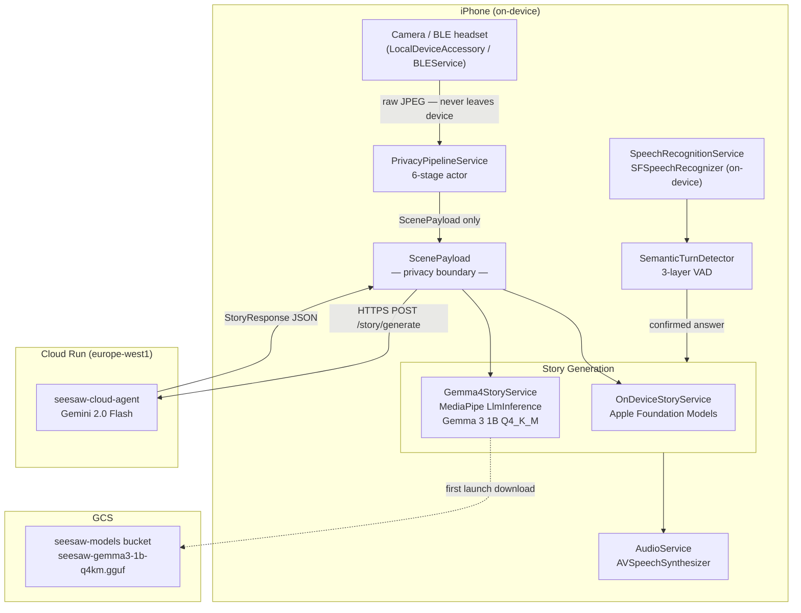
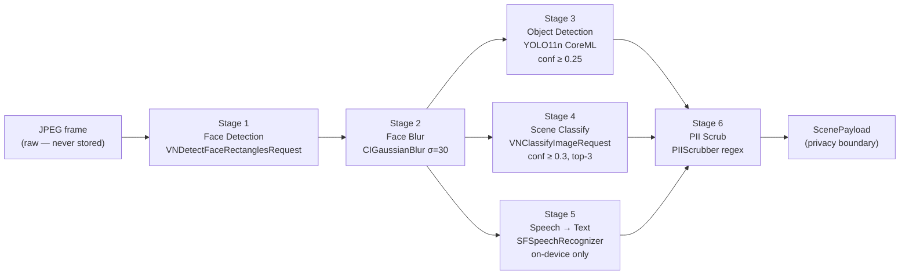
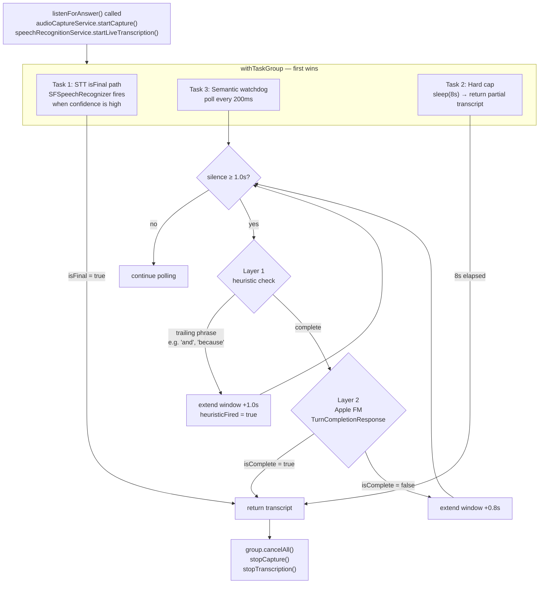
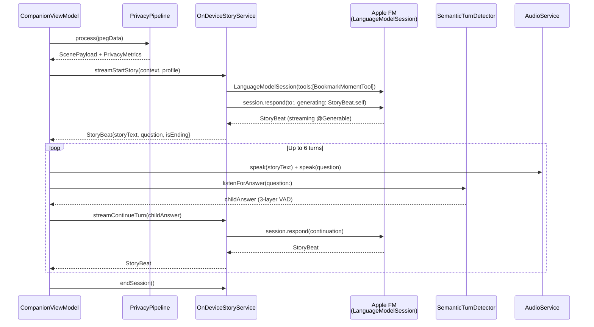
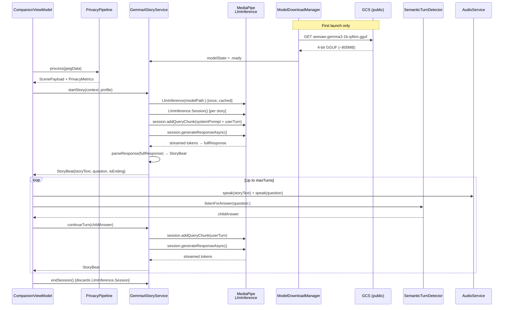
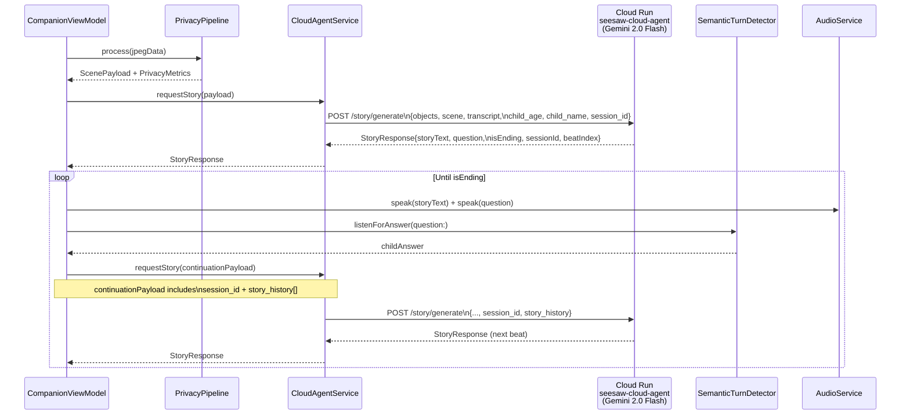
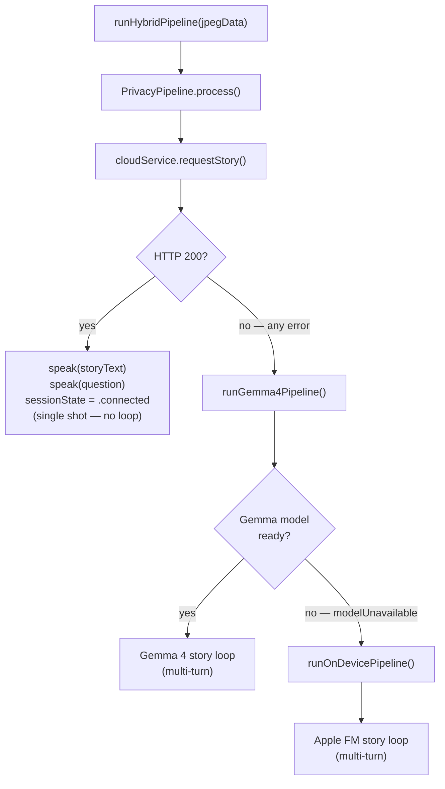
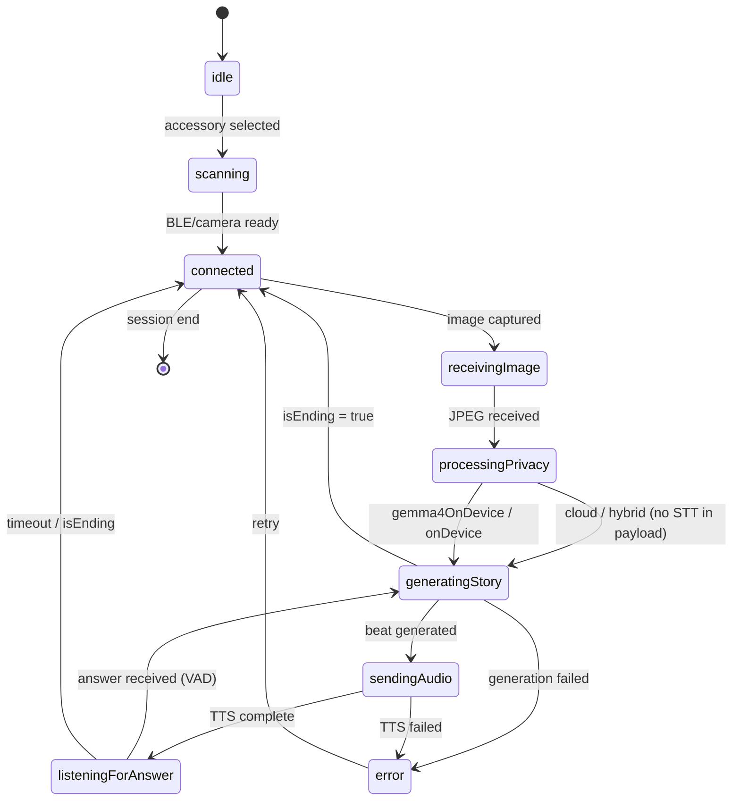

# SeeSaw Companion — Pipeline Reference

**Platform:** iOS 26+ · iPhone 12+ (Neural Engine)  
**Branch:** `mediapipe-integration`  
**Last updated:** 2026-04-15

---

## Table of Contents

1. [System Architecture](#1-system-architecture)
2. [Privacy Pipeline — All Modes](#2-privacy-pipeline--all-modes)
3. [VAD — Three-Layer Turn Detection](#3-vad--three-layer-turn-detection)
4. [Story Generation Modes](#4-story-generation-modes)
   - 4.1 [onDevice — Apple Foundation Models](#41-ondevice--apple-foundation-models)
   - 4.2 [gemma4OnDevice — MediaPipe LlmInference](#42-gemma4ondevice--mediapipe-llminference)
   - 4.3 [cloud — Cloud Run Agent](#43-cloud--cloud-run-agent)
   - 4.4 [hybrid — Cloud → Gemma 4 → Apple FM](#44-hybrid--cloud--gemma-4--apple-fm)
5. [End-to-End State Machine](#5-end-to-end-state-machine)
6. [Configuration Reference](#6-configuration-reference)
7. [Privacy Invariants](#7-privacy-invariants)

---

## 1. System Architecture



**Key architectural guarantee:** `ScenePayload` is the **only** struct that crosses the privacy boundary. It contains anonymous labels — no pixels, no face data, no audio.

```swift
// ScenePayload.swift — the privacy boundary
struct ScenePayload: Codable, Sendable {
    let objects:      [String]    // YOLO label strings  — no pixels
    let scene:        [String]    // scene classification — no pixels
    let transcript:   String?     // PII-scrubbed speech  — no audio
    let childAge:     Int
    let childName:    String
    let sessionId:    String
    let storyHistory: [StoryTurn]
}
```

---

## 2. Privacy Pipeline — All Modes

The same six-stage pipeline runs regardless of story generation mode. Stages 3+4+5 run in parallel.



### Stage implementation details

| Stage | API | Threshold | Timing |
|-------|-----|-----------|--------|
| Face detect | `VNDetectFaceRectanglesRequest` | — | ~15ms |
| Face blur | `CIGaussianBlur` | σ = 30 | ~8ms |
| Object detect | `VNCoreMLRequest` + `seesaw-yolo11n.mlpackage` | conf ≥ 0.25 | ~40ms |
| Scene classify | `VNClassifyImageRequest` | conf ≥ 0.3, top 3 | parallel with S3 |
| STT | `SFSpeechRecognizer` on-device | — | parallel with S3/S4 |
| PII scrub | `PIIScrubber.scrub()` regex | — | < 1ms |

```swift
// PrivacyPipelineService.swift — parallel execution of stages 3/4/5
async let objects    = detectObjects(in: blurredImage)      // Stage 3
async let scene      = classifyScene(in: blurredImage)      // Stage 4
async let transcript = recognizeSpeech(audioData: audioData) // Stage 5

let (detectedObjects, sceneLabels, rawTranscript) = try await (objects, scene, transcript)
```

### YOLO model — 44-class taxonomy

```swift
// PrivacyPipelineService.swift
private static let objectConfidenceThreshold: Float = 0.25
private static let classLabels: [String] = [
    // Layer 1 — furniture (HomeObjects-3K, 12 classes)
    "bed", "sofa", "chair", "table", "lamp", "tv", "laptop", "wardrobe",
    "window", "door", "potted_plant", "photo_frame",
    // Layer 2 — child environment (Roboflow, 13 classes)
    "teddy_bear", "book", "sports_ball", "backpack", "bottle", "cup",
    "building_blocks", "dinosaur_toy", "stuffed_animal", "picture_book",
    "crayon", "toy_car", "puzzle_piece",
    // Layer 3 — extended (19 classes)
    "carpet", "chimney", "clock", "crib", "cupboard", "curtains", "faucet",
    "floor_decor", "glass", "pillows", "pots", "rugs", "shelf", "stairs",
    "storage", "whiteboard", "toy_airplane", "toy_fire_truck", "toy_jeep"
]
```

---

## 3. VAD — Three-Layer Turn Detection

> **Dissertation contribution:** No existing children's AI companion uses on-device LLM semantic completion for VAD. All existing systems use acoustic VAD only.

`SemanticTurnDetector` runs as a concurrent task inside `listenForAnswer()`. Three tasks race in a `withTaskGroup`; the first to return wins.



### Layer 1 — Heuristic (< 1ms, synchronous)

```swift
// SemanticTurnDetector.swift
static let silenceThresholdSeconds:   Double = 1.0   // wait before checking
static let heuristicExtensionSeconds: Double = 1.0   // extend if trailing phrase
static let semanticExtensionSeconds:  Double = 0.8   // extend if FM says incomplete
static let hardCapSeconds:            Double = 8.0   // absolute maximum

private let trailingIncompletePhrases = [
    "and then", "but also", "and also", "what if", "i think",
    "because", "maybe", "and", "but", "like", "so", "or", "um", "uh",
]
```

### Layer 2 — Apple FM semantic check (~150ms)

```swift
// SemanticTurnDetector.swift
@Generable
struct TurnCompletionResponse: Sendable {
    @Guide(description: "True if the child has completed their response, false if mid-thought or trailing off")
    var isComplete: Bool
}

let session = LanguageModelSession(instructions: """
    You are a turn-taking detector for a children's story app.
    Respond only with the structured output indicating whether the child has finished speaking.
    """)

let response = try await session.respond(
    to: prompt,
    generating: TurnCompletionResponse.self
)
```

Fast-paths (skipping FM call):
- Empty transcript → `isComplete = true`
- Transcript ≤ 5 chars (e.g. "yes", "no") → `isComplete = true`
- Any error → `isComplete = true` (never block the story loop)

### Layer 3 — Hard cap (8s)

On timeout, returns whatever partial transcript was accumulated — short or interrupted utterances still drive the story forward.

---

## 4. Story Generation Modes

```swift
// StoryGenerationMode.swift
enum StoryGenerationMode: String, CaseIterable {
    case onDevice        // Apple Foundation Models — zero network
    case gemma4OnDevice  // MediaPipe LlmInference (Gemma 3 1B Q4_K_M) — zero network
    case cloud           // POST ScenePayload to Cloud Run — full conversation loop
    case hybrid          // cloud first → gemma4OnDevice fallback → onDevice fallback
}
```

---

### 4.1 `onDevice` — Apple Foundation Models



**Key implementation details:**

```swift
// OnDeviceStoryService.swift
private let maxTurns = 6
private let bookmarkTool = BookmarkMomentTool()

// @Generable structured output — Foundation Models fills fields type-safely
session = LanguageModelSession(tools: [bookmarkTool], instructions: systemPrompt)
let response = try await session.respond(to: prompt, generating: StoryBeat.self)
```

**Context window management:**
- `shouldSummariseContext()` triggers at turn 5 or when `conversationSummary` is stale
- On overflow: `restartWithSummary()` creates a new session with a compressed summary injected into the system prompt — conversation continues seamlessly

**Error recovery:**
- `LanguageModelSession.GenerationError` → retry with softened prompt (max 2 attempts)
- Guardrail violation → `StoryBeat.safeFallback` (predefined safe text)

**Streaming:** `streamStartStory` / `streamContinueTurn` use `ResponseStream<StoryBeat>` and call `onPartialText` per partial `storyText` token for real-time UI updates.

---

### 4.2 `gemma4OnDevice` — MediaPipe LlmInference



**Key implementation details:**

```swift
// Gemma4StoryService.swift — LlmInference lifecycle
private func loadInferenceIfNeeded(modelPath: String) throws {
    if llmInference != nil { return }  // cached after first load (~3-5s)
    let options = LlmInference.Options(modelPath: modelPath)
    options.maxTokens = 512
    llmInference = try LlmInference(options: options)
}

private func startNewLLMSession() throws {
    guard let inference = llmInference else { throw StoryError.modelUnavailable }
    let options = LlmInference.Session.Options()
    options.temperature = 0.8
    options.topK = 40
    options.topP = 0.95
    llmSession = try LlmInference.Session(llmInference: inference, options: options)
    // KV cache persists across turns within this session
}
```

**Response parsing — JSON preferred, heuristic fallback:**

```swift
// Gemma4StoryService.swift — parseResponse
static func parseResponse(_ raw: String, isFinalTurn: Bool) -> StoryBeat {
    // Primary: fine-tuned model outputs JSON
    // {"story_text": "...", "question": "...", "is_ending": false}
    if let json = try? JSONSerialization.jsonObject(with: clean.data(using: .utf8)!) as? [String: Any],
       let storyText = json["story_text"] as? String,
       let question  = json["question"]   as? String {
        let isEnding = isFinalTurn || ((json["is_ending"] as? Bool) ?? false)
        return StoryBeat(storyText: storyText, question: question, isEnding: isEnding)
    }
    // Fallback: heuristic — first 2 sentences = story, last sentence = question
}
```

**Chat template (Gemma 3 instruction format):**
```
<start_of_turn>user
{system_prompt}\n\n{user_turn}
<end_of_turn>
<start_of_turn>model
```
Turn 0 sends `system + user`. Continuations send `user` chunk only — KV cache preserves context.

**Model download (`ModelDownloadManager`):**
```swift
// Resolution order:
// 1. GET {cloudAgentBaseURL}/model/latest → signed GCS URL (1hr expiry)
// 2. UserDefaults "gemma4ModelURL" override
// → AppConfig.gemma4DirectDownloadURL seeded on first launch:
//    "https://storage.googleapis.com/seesaw-models/seesaw-gemma3-1b-q4km.gguf"
```

**Fallback chain:** If model is `.notDownloaded` or `.downloading` → `StoryError.modelUnavailable` → `runOnDevicePipeline()` (Apple FM) silently.

---

### 4.3 `cloud` — Cloud Run Agent



**Key implementation details:**

```swift
// CloudAgentService.swift
init(baseURL: URL?) { ... }  // nil → CloudError.notConfigured

func requestStory(payload: ScenePayload) async throws -> StoryResponse {
    guard let base = baseURL else { throw CloudError.notConfigured }
    let endpoint = base.appendingPathComponent("story/generate")
    // timeout: 75s (covers Cloud Run cold start ~30s + Gemini ~10s)
}
```

**Conversation continuity** — `continueCloudLoop` builds `story_history` client-side:
```swift
// CompanionViewModel.swift
var history = [StoryTurn(role: "model", text: lastBeat.storyText)]
// each turn:
history.append(StoryTurn(role: "user",  text: answer))
// posted as story_history in ScenePayload
history.append(StoryTurn(role: "model", text: beat.storyText))
sessionId = beat.sessionId  // server-side conversation anchor
```

**Endpoint:**
```
POST https://seesaw-cloud-agent-531853173205.europe-west1.run.app/story/generate
Content-Type: application/json
X-SeeSaw-Key: <cloudAgentAPIKey>
Timeout: 75s
```

---

### 4.4 `hybrid` — Cloud → Gemma 4 → Apple FM



> **Note:** The hybrid mode's cloud path is **single-shot** (one beat, no conversation loop). Cloud mode (`runCloudPipeline`) provides the full multi-turn cloud conversation. Hybrid is designed as a best-effort first beat from cloud, falling back to full on-device loop.

---

## 5. End-to-End State Machine



**State transitions per mode:**

| State | `onDevice` | `gemma4OnDevice` | `cloud` | `hybrid` |
|---|---|---|---|---|
| `processingPrivacy` | ✓ | ✓ | ✓ | ✓ |
| `requestingStory` | — | — | ✓ | ✓ |
| `generatingStory` | ✓ streaming | ✓ streaming | ✓ | ✓ or ✓ |
| `listeningForAnswer` | ✓ multi-turn | ✓ multi-turn | ✓ multi-turn | — (single beat) |
| Max turns | 6 | `maxTurns` | unlimited | 1 cloud beat |

---

## 6. Configuration Reference

All endpoints and model URLs are set in **`SeeSaw/App/AppConfig.swift`** and seeded into `UserDefaults` on first launch. The Settings UI can override them at runtime without a rebuild.

```swift
// AppConfig.swift — EDIT THESE FOR YOUR DEPLOYMENT

/// Cloud Run story-agent base URL
static let cloudAgentBaseURL = "https://seesaw-cloud-agent-531853173205.europe-west1.run.app"

/// API key sent as X-SeeSaw-Key header (leave empty if unauthenticated)
static let cloudAgentAPIKey  = ""

/// Direct GGUF download URL — bypasses Cloud Run /model/latest
static let gemma4DirectDownloadURL =
    "https://storage.googleapis.com/seesaw-models/seesaw-gemma3-1b-q4km.gguf"
```

**Seeding logic** (`AppDependencyContainer.seedDefaultsFromConfig()`):
- Only writes when the stored value is nil/empty — runtime overrides persist across relaunches
- `cloudAgentBaseURL` sentinel `"https://your-cloud-run-url"` is treated as unconfigured

**Detection thresholds** (`PrivacyPipelineService.swift`):
```swift
private static let objectConfidenceThreshold: Float = 0.25  // YOLO NMS post-filter
private static let sceneConfidenceThreshold:  Float = 0.3   // VNClassifyImageRequest
```

**VAD timing** (`SemanticTurnDetector.swift`):
```swift
static let silenceThresholdSeconds:   Double = 1.0   // wait before Layer 1
static let heuristicExtensionSeconds: Double = 1.0   // Layer 1 extension
static let semanticExtensionSeconds:  Double = 0.8   // Layer 2 extension
static let hardCapSeconds:            Double = 8.0   // Layer 3 absolute cap
```

**LLM session** (`Gemma4StoryService.swift`):
```swift
options.maxTokens   = 512
options.temperature = 0.8
options.topK        = 40
options.topP        = 0.95
```

**Cloud timeout** (`CloudAgentService.swift`):
```swift
config.timeoutIntervalForRequest = 75  // 75s: covers Cloud Run cold start + Gemini
```

**Apple FM session** (`OnDeviceStoryService.swift`):
```swift
private let maxTurns = 6              // context window budget
private let bookmarkTool = BookmarkMomentTool()  // only active tool (65-token schema)
// AdjustDifficultyTool and SwitchSceneTool disabled — schema overhead too high
```

---

## 7. Privacy Invariants

These invariants hold across all four story generation modes and are verifiable via Xcode Network Inspector:

| Invariant | Mechanism |
|---|---|
| Raw JPEG never stored | `CIImage` allocated in-memory; `Data` released after pipeline |
| Raw JPEG never transmitted | Only `ScenePayload` (labels) crosses the network boundary |
| Audio never transmitted | `SFSpeechRecognizer` on-device only flag; audio buffer released after STT |
| Face biometrics never transmitted | Faces blurred to `CIGaussianBlur σ=30` before any further processing |
| PII scrubbed before any transmission | `PIIScrubber.scrub()` runs on transcript before `ScenePayload` construction |
| On-device modes: zero network | `onDevice` and `gemma4OnDevice` make no outbound HTTP during story generation |

```swift
// PrivacyPipelineService.swift — enforced in ScenePayload construction
let payload = ScenePayload(
    objects:    detectedObjects,   // ["teddy_bear", "book"] — labels only
    scene:      sceneLabels,       // ["bedroom"] — labels only
    transcript: cleanTranscript,   // PII-scrubbed or nil
    childAge:   childAge,
    childName:  childName,
    sessionId:  UUID().uuidString
)
// rawImage / ciImage / blurredImage go out of scope here and are released
```

**Metrics captured per pipeline run** (`PrivacyMetricsEvent`):
- `facesDetected`, `facesBlurred` — confirm blur applied to all faces
- `tokensScrubbedFromTranscript` — audit trail for PII removal
- `rawDataTransmitted: false` — programmatic invariant check
- Per-stage latency: `faceDetectMs`, `blurMs`, `yoloMs`, `sceneClassifyMs`, `sttMs`, `piiScrubMs`, `pipelineLatencyMs`
